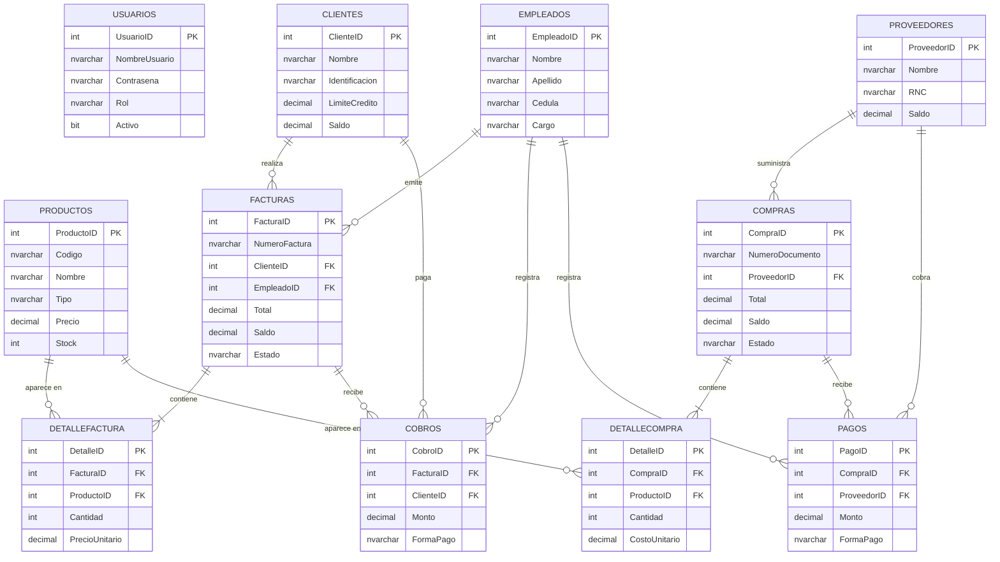

# Informe del Proyecto Final
## Sistema de Facturación y Cuentas por Cobrar / Cuentas por Pagar

**Asignatura:** Programación
**Tecnologías:** C# · Windows Forms · ADO.NET · SQL Server
**Fecha:** 1 de julio de 2026

> **Nota para la entrega:** Este documento está en formato Markdown para que puedas
> revisarlo y editarlo fácilmente. Para generar el **PDF** final, ábrelo en Visual
> Studio Code (extensión *Markdown PDF*), en Word, o pégalo en Google Docs y exporta a
> PDF. Recuerda **insertar las capturas de pantalla** en los espacios indicados con
> `[CAPTURA ...]` y agregar el **enlace de tu video** en la última sección.

---

## Índice
1. Introducción
2. Objetivos
3. Tecnologías utilizadas
4. Arquitectura de la aplicación (3 capas)
5. Diseño de la base de datos (ERD y esquema)
6. Lógica de negocio implementada
7. Descripción de los módulos (con capturas)
8. Validaciones y manejo de excepciones
9. Instrucciones de instalación y ejecución
10. Reflexiones: proceso, desafíos y aprendizajes
11. Enlace al video

---

## 1. Introducción

El presente proyecto consiste en una **aplicación de escritorio** que simula el sistema
de **facturación y gestión de cuentas por cobrar y por pagar** de una empresa comercial.
Permite administrar clientes, proveedores, productos/servicios, empleados y usuarios;
emitir facturas de venta, registrar los cobros de esas facturas, registrar compras a
proveedores y los pagos correspondientes, manteniendo en todo momento los **saldos**
actualizados y el **inventario** consistente.

La aplicación fue construida siguiendo buenas prácticas de ingeniería de software:
separación en **capas lógicas**, uso de **clases y objetos** para representar las
entidades del negocio, **operaciones transaccionales** para garantizar la integridad de
los datos, **validaciones** de entrada y **manejo de excepciones** amigable para el
usuario.

## 2. Objetivos

**Objetivo general:** Desarrollar un sistema de facturación y cuentas por cobrar/pagar en
C# con Windows Forms y base de datos relacional en SQL Server.

**Objetivos específicos:**
- Diseñar una base de datos relacional normalizada con todas las tablas y relaciones.
- Implementar operaciones CRUD sobre todas las entidades mediante ADO.NET.
- Programar la lógica de negocio: cálculo de facturas (subtotal, impuesto, total),
  actualización de saldos y control de inventario.
- Encapsular datos y comportamiento usando clases y objetos.
- Construir una interfaz gráfica clara y coherente con el tipo de aplicación.
- Aplicar validaciones y un manejo de excepciones robusto.

## 3. Tecnologías utilizadas

| Área | Tecnología |
|------|-----------|
| Lenguaje | C# (.NET Framework 4.7.2) |
| Interfaz de usuario | Windows Forms |
| Acceso a datos | ADO.NET (`System.Data.SqlClient`) |
| Base de datos | Microsoft SQL Server (LocalDB / Express) |
| IDE | Visual Studio |
| Seguridad | Hash de contraseñas con SHA-256 |

## 4. Arquitectura de la aplicación (3 capas)

La solución está organizada en **tres capas lógicas** claramente separadas, más un
conjunto de **entidades** compartidas:

```
┌─────────────────────────────────────────────┐
│   CAPA DE PRESENTACIÓN  (Presentacion/)      │  Formularios Windows Forms
│   FrmLogin, FrmPrincipal, FrmClientes, ...   │
└───────────────────────┬─────────────────────┘
                        │ usa
┌───────────────────────▼─────────────────────┐
│   CAPA DE NEGOCIO  (Negocio/)                │  Validaciones, cálculos, saldos
│   FacturaNegocio, CobroNegocio, ...          │
└───────────────────────┬─────────────────────┘
                        │ usa
┌───────────────────────▼─────────────────────┐
│   CAPA DE ACCESO A DATOS  (DatosAcceso/)     │  ADO.NET, comandos SQL, transacciones
│   ConexionBD, FacturaDAO, CobroDAO, ...      │
└───────────────────────┬─────────────────────┘
                        │ ADO.NET
┌───────────────────────▼─────────────────────┐
│        BASE DE DATOS  SQL Server             │
└─────────────────────────────────────────────┘

        Entidades/  (clases POCO compartidas por todas las capas)
```

**Ventajas de esta separación:**
- La **presentación** no conoce SQL: solo llama a la capa de negocio.
- La **lógica de negocio** concentra las reglas (cálculo de impuestos, validación de
  crédito, control de saldos), de modo que son fáciles de mantener y probar.
- La **capa de datos** aísla el acceso a la base de datos; si se cambiara de motor,
  solo se modificaría esta capa.

## 5. Diseño de la base de datos (ERD y esquema)

### 5.1 Diagrama Entidad-Relación (ERD)



> Si tu editor no muestra el diagrama, pega este bloque en <https://mermaid.live> para
> verlo y exportarlo como imagen para el PDF.

### 5.2 Esquema relacional (tablas, tipos y relaciones)

| Tabla | Campos principales | Relaciones (FK) |
|-------|--------------------|-----------------|
| **Usuarios** | UsuarioID (PK), NombreUsuario, Contrasena (hash), Rol, Activo | — |
| **Empleados** | EmpleadoID (PK), Nombre, Apellido, Cedula, Cargo, Email | — |
| **Clientes** | ClienteID (PK), Nombre, Identificacion, LimiteCredito, **Saldo** | — |
| **Proveedores** | ProveedorID (PK), Nombre, RNC, **Saldo** | — |
| **Productos** | ProductoID (PK), Codigo, Nombre, Tipo, Precio, Costo, Stock | — |
| **Facturas** | FacturaID (PK), NumeroFactura, Fecha, Subtotal, Impuesto, Total, **Saldo**, TipoPago, Estado | ClienteID → Clientes, EmpleadoID → Empleados |
| **DetalleFactura** | DetalleID (PK), Cantidad, PrecioUnitario, Importe | FacturaID → Facturas (CASCADE), ProductoID → Productos |
| **Cobros** | CobroID (PK), Fecha, Monto, FormaPago, Referencia | FacturaID → Facturas, ClienteID → Clientes, EmpleadoID → Empleados |
| **Compras** | CompraID (PK), NumeroDocumento, Fecha, Subtotal, Impuesto, Total, **Saldo**, Estado | ProveedorID → Proveedores |
| **DetalleCompra** | DetalleID (PK), Cantidad, CostoUnitario, Importe | CompraID → Compras (CASCADE), ProductoID → Productos |
| **Pagos** | PagoID (PK), Fecha, Monto, FormaPago, Referencia | CompraID → Compras, ProveedorID → Proveedores, EmpleadoID → Empleados |

Se aplicaron restricciones de integridad: **claves primarias**, **claves foráneas**,
restricciones **UNIQUE** (p. ej. número de factura, código de producto), **CHECK**
(estados válidos, montos positivos, tipo de pago) y **DEFAULT** (fechas, activos, saldos).
El script completo está en `Database/01_CrearBaseDatos.sql`.

## 6. Lógica de negocio implementada

### 6.1 Cálculo de la factura
Al emitir una factura, por cada línea se calcula `Importe = Cantidad × PrecioUnitario`.
Luego:

```
Subtotal  = Σ Importe de las líneas
Impuesto  = Subtotal × 18%   (ITBIS)
Total     = Subtotal + Impuesto
```

El **tipo de pago** determina el saldo inicial:
- **Contado:** la factura queda `Saldo = 0` y `Estado = Pagada`.
- **Crédito:** la factura queda `Saldo = Total` y `Estado = Pendiente`, generando una
  **Cuenta por Cobrar**.

### 6.2 Control de inventario
Al facturar un **Producto** se **descuenta** su `Stock`; al anular la factura se
**devuelve**. Los **Servicios** no afectan el inventario. Antes de facturar se verifica
que exista **stock suficiente**. En las **compras** ocurre lo inverso: el stock **aumenta**.

### 6.3 Actualización de saldos (Cuentas por Cobrar y por Pagar)
- Cada factura a crédito **incrementa** el `Saldo` del cliente.
- Cada **cobro** **reduce** el saldo de la factura y del cliente; si la factura queda en
  cero, su estado pasa a **Pagada**.
- Cada compra **incrementa** el `Saldo` del proveedor (Cuenta por Pagar).
- Cada **pago** **reduce** el saldo de la compra y del proveedor.

### 6.4 Límite de crédito
En las ventas a crédito se valida que el nuevo saldo del cliente no exceda su
**límite de crédito** configurado.

### 6.5 Integridad transaccional
Las operaciones que tocan varias tablas (crear factura + detalle + inventario + saldo;
registrar cobro; crear compra; registrar pago; anular factura) se ejecutan dentro de una
**transacción de ADO.NET** (`SqlTransaction`). Si cualquier paso falla, se hace
`Rollback` y **ningún** cambio queda a medias, garantizando la consistencia de los datos.

## 7. Descripción de los módulos

Para cada módulo, inserta una captura de pantalla de la aplicación en ejecución.

- **Inicio de sesión** — autenticación con usuario y contraseña.
  `[CAPTURA: Pantalla de login]`
- **Menú principal** — navegación por todos los módulos.
  `[CAPTURA: Ventana principal con el menú]`
- **Clientes / Proveedores / Productos / Empleados / Usuarios** — mantenimiento CRUD.
  `[CAPTURA: Formulario de Clientes con la tabla y el panel de datos]`
  `[CAPTURA: Formulario de Productos]`
- **Facturación** — listado de facturas y creación de una nueva factura con su detalle.
  `[CAPTURA: Lista de facturas]`
  `[CAPTURA: Formulario de nueva factura mostrando subtotal, ITBIS y total]`
- **Cobros** — registro de abonos y su historial.
  `[CAPTURA: Formulario de cobros]`
- **Compras** — listado y registro de compras a proveedores.
  `[CAPTURA: Formulario de nueva compra]`
- **Pagos** — registro de pagos a proveedores.
  `[CAPTURA: Formulario de pagos]`

## 8. Validaciones y manejo de excepciones

- **Validación de entrada:** campos obligatorios, formatos numéricos (precio, monto,
  stock), formato de correo electrónico, cantidades y montos positivos. Implementadas en
  la clase `Negocio/Validaciones.cs`.
- **Excepciones de negocio:** se usa una excepción propia `NegocioException` para
  distinguir los errores esperados (dato inválido, stock insuficiente, monto mayor al
  saldo, crédito excedido) de los errores del sistema. Estos se muestran al usuario como
  **advertencias amigables**.
- **Excepciones de base de datos / sistema:** se capturan con `try/catch`, mostrando un
  mensaje claro sin cerrar la aplicación. Además, `Program.cs` instala un manejador
  **global** de excepciones no controladas.
- **Reglas de seguridad:** las contraseñas se guardan cifradas (SHA-256); el módulo de
  Usuarios solo es accesible para el rol **Administrador**; un usuario no puede eliminarse
  a sí mismo.

## 9. Instrucciones de instalación y ejecución

Consulta el archivo **`README.md`** en la raíz del proyecto. Resumen:
1. Instalar **SQL Server** (LocalDB o Express).
2. Ejecutar `Database/01_CrearBaseDatos.sql` y luego `Database/02_DatosPrueba.sql`.
3. Ajustar la cadena de conexión en `App.config` si es necesario.
4. Compilar con Visual Studio (`F5`) o con `Compilar.bat`.
5. Entrar con `admin` / `admin123`.

## 10. Reflexiones: proceso, desafíos y aprendizajes

> *(Personaliza esta sección con tu experiencia. A continuación un punto de partida.)*

- **Proceso:** El desarrollo comenzó por el **diseño de la base de datos**, ya que define
  la estructura de todo el sistema. Luego se construyeron las **entidades**, la **capa de
  datos**, la **lógica de negocio** y por último la **interfaz**.
- **Desafíos:** El principal reto fue mantener la **consistencia de los saldos y el
  inventario** cuando una operación afecta varias tablas; se resolvió con **transacciones**.
  Otro desafío fue organizar el código en **capas** para que la interfaz no dependiera
  directamente de SQL.
- **Aprendizajes:** Uso de **ADO.NET** con comandos parametrizados (evitando inyección
  SQL), diseño de **bases de datos relacionales** con integridad referencial, aplicación
  de **programación orientada a objetos** para modelar el dominio y la importancia del
  **manejo de excepciones** para una buena experiencia de usuario.

## 11. Enlace al video

- **Video explicativo (con rostro y voz):** `[PEGAR AQUÍ EL ENLACE DE YOUTUBE]`
- Asegúrate de que el enlace sea **público** o "**no listado**" (accesible sin pedir
  permiso) y que en el video se vea la aplicación **funcionando**: login, alta de un
  cliente/producto, emisión de una factura, registro de un cobro y de un pago.

---

*Fin del informe.*
