# Sistema de Facturación y Cuentas por Cobrar / Pagar

Proyecto Final de Programación — Aplicación de escritorio en **C# / Windows Forms** con
acceso a datos **ADO.NET** sobre **SQL Server**, organizada en **3 capas**
(Presentación, Lógica de Negocio y Acceso a Datos).

---

## 1. Requisitos previos

| Componente | Detalle |
|------------|---------|
| Sistema operativo | Windows 10 / 11 |
| .NET Framework | 4.7.2 o superior (ya incluido en Windows 11) |
| Motor de base de datos | **SQL Server** (Express, Developer o **LocalDB**) |
| Para compilar | Visual Studio 2022+ **o** el archivo `Compilar.bat` incluido |

---

## 2. Instalación de la base de datos

1. Abra **SQL Server Management Studio (SSMS)** o **Azure Data Studio** y conéctese a su
   instancia (por ejemplo `(localdb)\MSSQLLocalDB` o `.\SQLEXPRESS`).
2. Abra y ejecute, **en este orden**, los scripts de la carpeta `Database`:
   1. `01_CrearBaseDatos.sql`  → crea la base de datos, tablas y relaciones.
   2. `02_DatosPrueba.sql`     → inserta los datos de prueba iniciales.

   *Alternativa por línea de comandos (si tiene `sqlcmd`):*
   ```bat
   sqlcmd -S (localdb)\MSSQLLocalDB -i Database\01_CrearBaseDatos.sql
   sqlcmd -S (localdb)\MSSQLLocalDB -i Database\02_DatosPrueba.sql
   ```

---

## 3. Configurar la cadena de conexión

Edite el archivo **`App.config`** (o `bin\Debug\SistemaFacturacion.exe.config` si ya está
compilado) y ajuste el atributo `connectionString` según su instalación:

```xml
<!-- SQL Server local (instancia predeterminada) -->
<add name="SistemaFacturacionDB"
     connectionString="Server=localhost;Database=SistemaFacturacionDB;Integrated Security=True;TrustServerCertificate=True;"
     providerName="System.Data.SqlClient" />

<!-- LocalDB -->
<!-- Server=(localdb)\MSSQLLocalDB;Database=SistemaFacturacionDB;Integrated Security=True;TrustServerCertificate=True; -->

<!-- SQL Server Express -->
<!-- Server=.\SQLEXPRESS;Database=SistemaFacturacionDB;Integrated Security=True;TrustServerCertificate=True; -->

<!-- Usuario y contraseña -->
<!-- Server=NOMBRE;Database=SistemaFacturacionDB;User Id=sa;Password=SuClave;TrustServerCertificate=True; -->
```

---

## 4. Compilar y ejecutar

### Opción A — con Visual Studio
1. Abra `SistemaFacturacion.sln`.
2. Presione **F5** (compilar y ejecutar).

### Opción B — sin Visual Studio (script incluido)
1. Haga doble clic en **`Compilar.bat`**.
2. El ejecutable se genera en `bin\Debug\SistemaFacturacion.exe` y el script le
   preguntará si desea ejecutarlo.

---

## 5. Credenciales de acceso

| Usuario | Contraseña | Rol |
|---------|-----------|-----|
| `admin`  | `admin123` | Administrador (acceso total, incluye Usuarios) |
| `cajero` | `user123`  | Usuario (operación diaria) |

Las contraseñas se almacenan cifradas con **SHA-256**; nunca se guardan en texto plano.

---

## 6. Estructura del proyecto

```
SistemaFacturacion/
├── Entidades/       ← Clases/objetos (Cliente, Factura, Cobro, ...)
├── DatosAcceso/     ← Capa de datos ADO.NET (ConexionBD + DAOs)
├── Negocio/         ← Lógica de negocio (cálculos, saldos, validaciones)
├── Presentacion/    ← Formularios Windows Forms
├── Database/        ← Scripts SQL (crear BD + datos de prueba)
├── Documentacion/   ← Informe del proyecto
├── App.config       ← Cadena de conexión
├── Program.cs       ← Punto de entrada
└── Compilar.bat     ← Compila sin Visual Studio
```

---

## 7. Módulos incluidos

- **Mantenimiento:** Clientes, Proveedores, Productos/Servicios, Empleados, Usuarios.
- **Cuentas por Cobrar:** Facturación (con inventario y ITBIS) y Cobros.
- **Cuentas por Pagar:** Compras (con inventario) y Pagos.

Consulte el informe completo en `Documentacion/Informe.md`.

---

## 8. Capturas de pantalla

### Inicio de sesión
Ventana de acceso con usuario y contraseña (hash SHA-256).

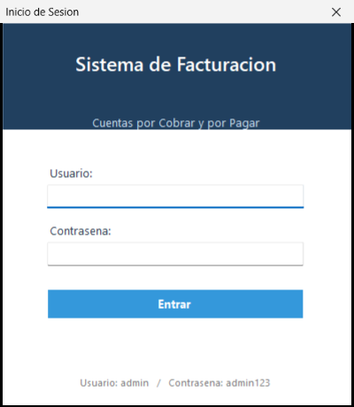

### Menú principal
Ventana principal con todos los módulos y el usuario en sesión.

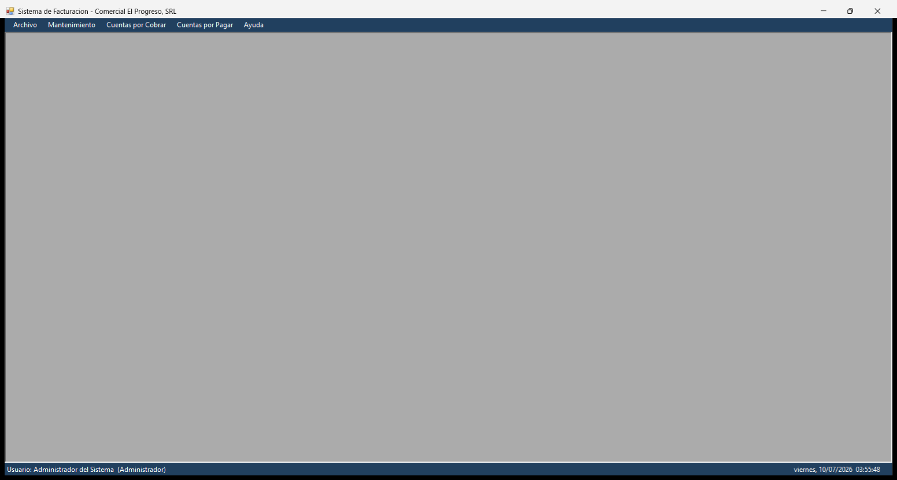

### Mantenimiento de Clientes
Listado con saldos, límite de crédito y panel de datos.

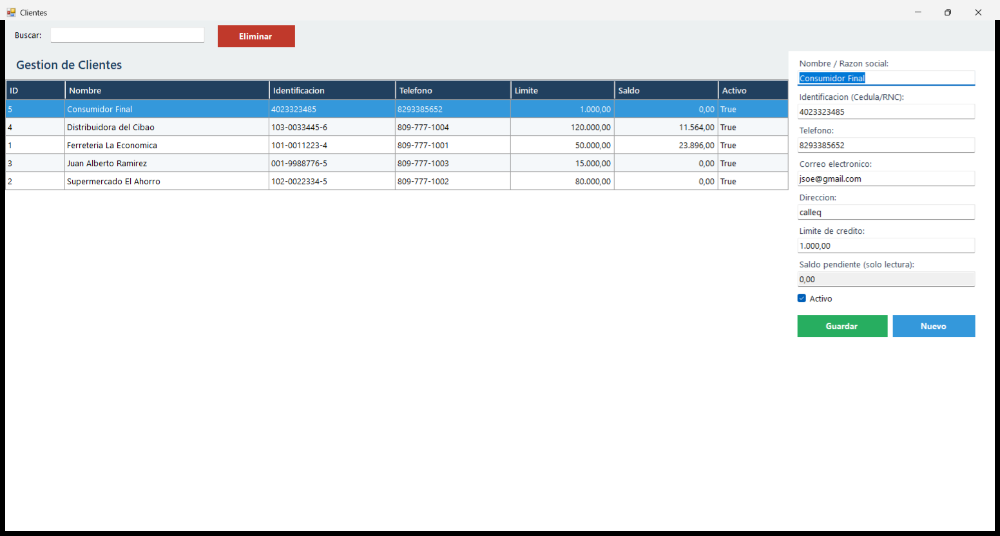

### Productos y Servicios
Catálogo con precios, costos y existencias (stock).

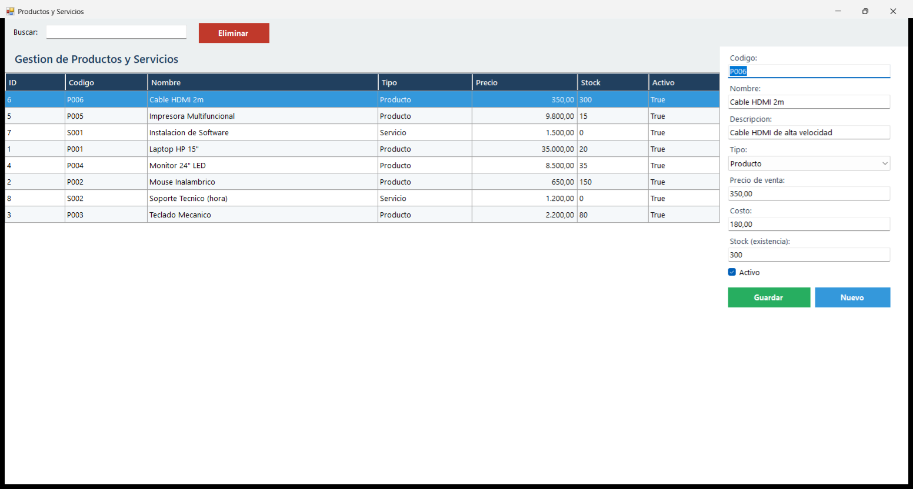

### Empleados
Registro del personal que emite los documentos.

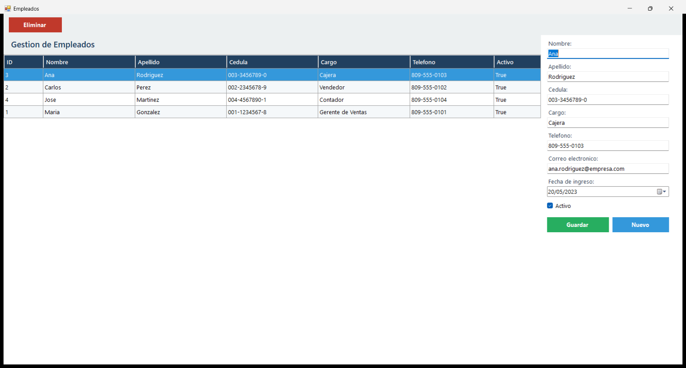

### Proveedores
Gestión de proveedores y sus saldos por pagar.

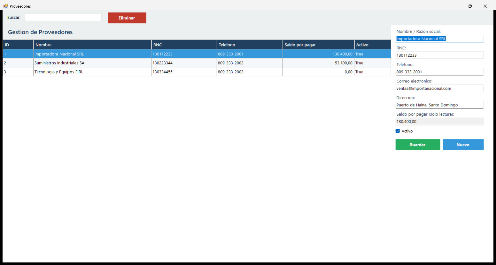

### Usuarios
Administración de cuentas de acceso y roles (solo Administrador).

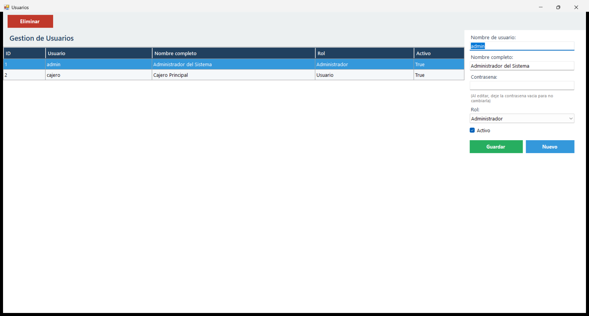

### Facturación — listado
Facturas con su tipo de pago, estado y saldo.

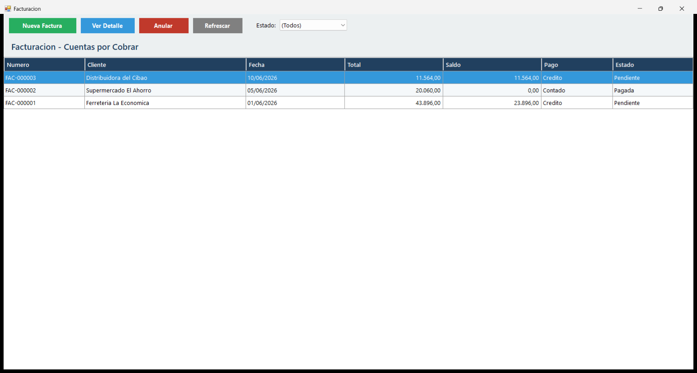

### Nueva factura
Emisión de una factura con subtotal, ITBIS (18 %) y total.

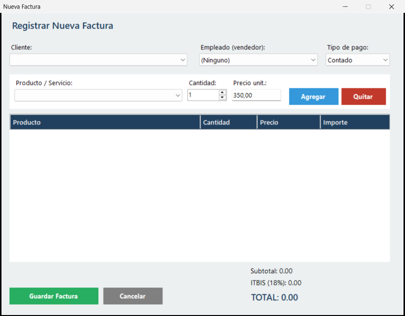

### Registro de cobros
Cobros aplicados a las facturas de crédito.

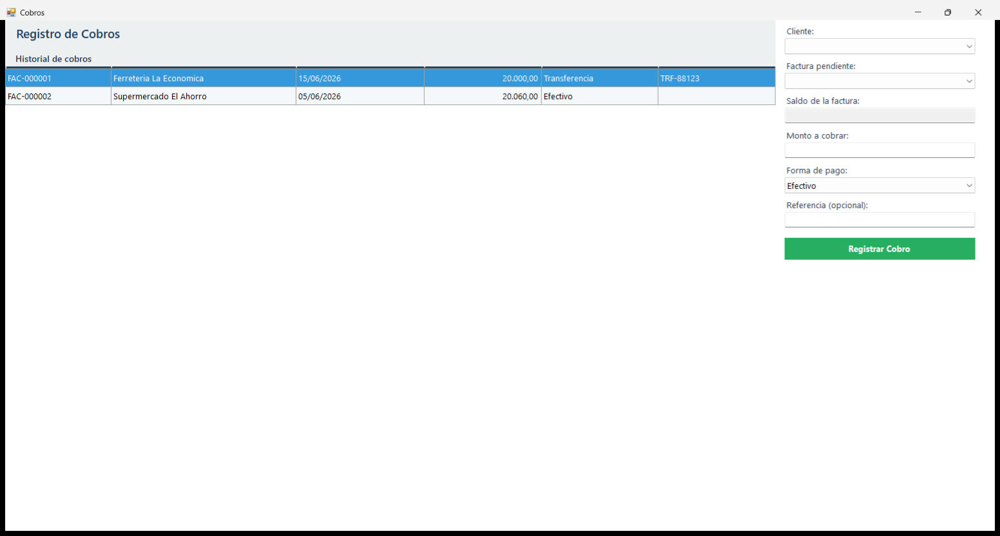

### Compras — listado
Compras registradas a los proveedores.

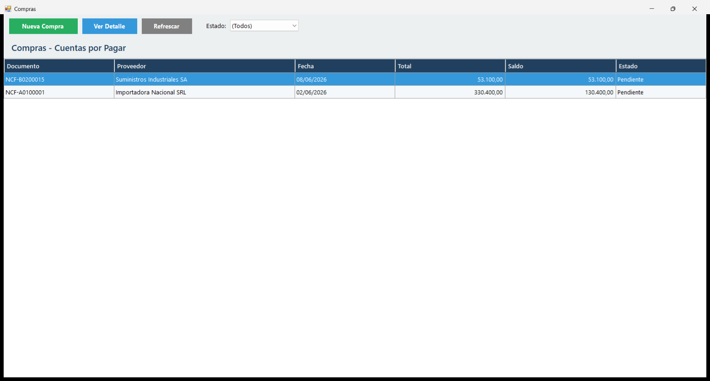

### Nueva compra
Registro de una compra a proveedor con su detalle.

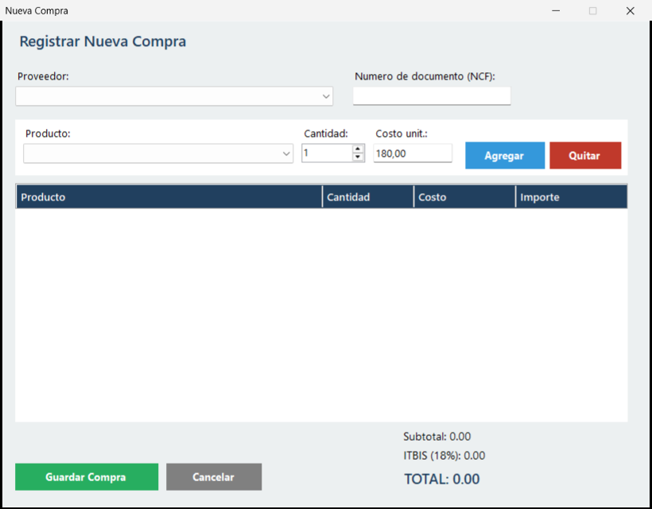

### Registro de pagos
Pagos realizados a los proveedores.

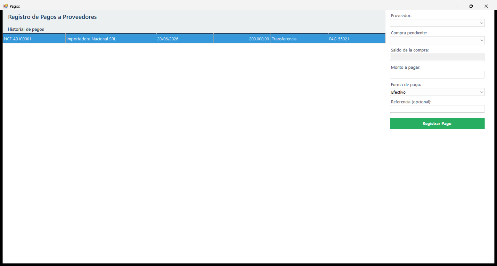
